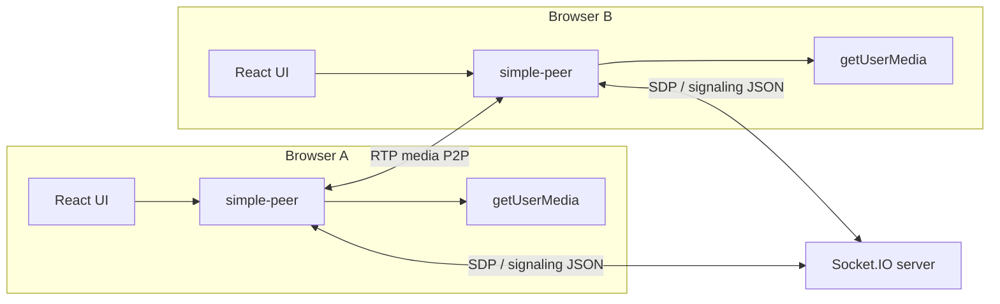

# WebRTC Video Chat Example — How It Works

This document explains the architecture, signaling flow, and main code paths of this project: a **1-to-1 video call** demo built with **React**, **Socket.IO** (signaling), and **simple-peer** (WebRTC wrapper).

---

## Table of contents

1. [Big picture](#big-picture)
2. [Why signaling exists](#why-signaling-exists)
3. [Project layout](#project-layout)
4. [Running the app](#running-the-app)
5. [The signaling server](#the-signaling-server)
6. [The React client](#the-react-client)
7. [End-to-end call sequence](#end-to-end-call-sequence)
8. [simple-peer in this project](#simple-peer-in-this-project)
9. [State and refs in `Context.js`](#state-and-refs-in-contextjs)
10. [UI components](#ui-components)
11. [Hang up, decline, and remote disconnect](#hang-up-decline-and-remote-disconnect)
12. [Configuration and deployment notes](#configuration-and-deployment-notes)
13. [Troubleshooting](#troubleshooting)

---

## Big picture

WebRTC lets two browsers exchange **audio/video directly** (peer-to-peer) once a connection is established. Your app still needs a **signaling channel** to exchange metadata (SDP offers/answers and ICE candidates) before media can flow.

In this example:

| Layer | Technology | Role |
|--------|------------|------|
| **Signaling** | Express + Socket.IO (`api/`) | Relays call setup messages between peers using **Socket.IO room addressing** (`io.to(socketId)`). |
| **Media + WebRTC** | `simple-peer` + `getUserMedia` (`client/`) | Builds the RTCPeerConnection, attaches local streams, and exposes the remote stream. |
| **UI** | React + MUI | Video tiles, name/ID fields, incoming call modal. |

Neither the REST API nor Socket.IO carry the actual video frames; they only carry small **signaling payloads** (JSON).



---

## Why signaling exists

Before two peers can send media, each browser must:

1. Know **what codecs and media** to use → exchanged via **SDP** (Session Description Protocol).
2. Know **network paths** to reach the other peer → **ICE** candidates gathered and exchanged.

The browser does not magically know the other peer’s addresses. This app uses **Socket.IO** so each client can send the SDP/ICE bundle produced by `simple-peer` to the other client’s **socket id** (treated as the “address” for signaling).

**Important:** This demo does not implement a production-grade presence list, rooms, or auth. Two users manually **copy/paste** one socket id into the other’s “ID to call” field.

---

## Project layout

```text
WebRTC/
├── api/                          # Signaling backend
│   ├── index.js                  # Express + HTTP server + Socket.IO
│   └── sockets/
│       └── videoCallSocketHandler.js
├── client/                       # React SPA
│   ├── src/
│   │   ├── App.js                # Wraps app in ContextProvider
│   │   ├── context/
│   │   │   └── Context.js        # Socket + peer + call state
│   │   ├── Pages/videocall/
│   │   │   └── VideoChat.jsx     # Page layout
│   │   └── Components/videocall/
│   │       ├── VideoPlayer.jsx   # Local/remote <video>, camera toggle
│   │       ├── Sidebar.jsx       # Name, copy ID, dial, hang up
│   │       └── Notifications.jsx # Incoming call modal
│   └── package.json
└── TUTORIAL.md                   # This file
```

---

## Running the app

1. **Start the API** (default port **3001**):

   ```bash
   cd api
   npm install
   npm start
   ```

2. **Start the client** (Create/React App dev server, often **3000**):

   ```bash
   cd client
   npm install
   npm start
   ```

3. Open **two browser tabs** (or two browsers) to the client URL. In each tab: turn on the camera if needed, **copy your ID**, paste the other tab’s ID, and click **Call**.

---

## The signaling server

File: `api/index.js` creates an HTTP server and attaches Socket.IO with permissive CORS (suitable for local dev). The socket logic lives in `api/sockets/videoCallSocketHandler.js`.

### Connection bootstrap

When a client connects:

- The server logs the new connection.
- It immediately emits **`me`** with **`socket.id`**. The React app stores this as the user’s public “phone number” for this session.

### Events (client → server → client)

| Client emits | Payload (shape) | Server behavior |
|--------------|-----------------|-----------------|
| **`callUser`** | `{ userToCall, signalData, from, name }` | Forwards to callee: `io.to(userToCall).emit('callUser', { signal, from, name })`. |
| **`answerCall`** | `{ signal, to }` | Sends answer SDP to caller: `io.to(to).emit('callAccepted', signal)`. |
| **`endCall`** | `{ to }` | Notifies peer: `io.to(to).emit('callEnded')`. |
| **`callRejected`** | `{ to }` | Notifies caller: `io.to(to).emit('callRejected')`. |

The server **does not** interpret SDP; it only routes messages by Socket.IO id.

---

## The React client

### Entry wiring

- `App.js` wraps the UI in **`ContextProvider`** from `client/src/context/Context.js`.
- `VideoChat.jsx` composes `VideoPlayer`, `Sidebar`, and `Notifications`.

### Single shared socket

`Context.js` creates **one** Socket.IO client:

```text
REACT_APP_SIGNALING_URL  →  default http://127.0.0.1:3001
```

That socket stays connected for the lifetime of the SPA, which avoids reconnect complexity for this demo.

### Media

- **Local:** `navigator.mediaDevices.getUserMedia({ video: true, audio: true })`.
- **Local preview:** `VideoPlayer.jsx` assigns `stream` to a `<video ref>` with `srcObject`.
- **Remote:** When the peer connection is established, `simple-peer` fires `stream`; that is stored as `userStream` and bound to a second `<video>`.
- **Remote audio:** The remote `<video>` is **not** muted so you can hear the other person (browser autoplay policies may require a user gesture first).

---

## End-to-end call sequence

This is the **happy path** when **A** calls **B**.

```mermaid
sequenceDiagram
  participant A as Caller (A)
  participant S as Socket.IO server
  participant B as Callee (B)

  Note over A,B: Both already connected; B has socket id B_id, A has A_id

  A->>A: getUserMedia → local stream
  A->>A: new Peer(initiator: true, stream, trickle: false)
  A->>A: peer.on('signal') ...
  A->>S: emit callUser { userToCall: B_id, signalData, from: A_id, name }
  S->>B: emit callUser { signal, from: A_id, name }
  B->>B: setCall({ isReceivingCall, from, signal, name })
  B->>B: Modal: Accept / Decline

  B->>B: Accept → getUserMedia
  B->>B: new Peer(initiator: false, stream)
  B->>B: peer.signal(incoming signal)
  B->>S: emit answerCall { signal, to: A_id }
  S->>A: emit callAccepted(answer signal)
  A->>A: peer.signal(answer signal)

  Note over A,B: ICE completes; negotiated; media flows P2P
  A-->>B: RTP audio/video
  B-->>A: RTP audio/video
```

**Callee decline:** B emits **`callRejected`** to A’s socket id; A tears down the half-built peer and resets UI.

**Hang up:** Either side emits **`endCall`** to the other; both clean up peer connection and remote stream.

---

## simple-peer in this project

[`simple-peer`](https://github.com/feross/simple-peer) wraps the browser `RTCPeerConnection` API.

### Initiator vs answerer

| Role | `initiator` | When created |
|------|-------------|---------------|
| **Caller** | `true` | In `callUser(id)` after local media is ready. |
| **Callee** | `false` | In `answerCall()` after accepting and obtaining local media. |

The **caller** creates the offer; the first `signal` event yields SDP that is sent as **`callUser.signalData`**. The **callee** consumes that with **`peer.signal(call.signal)`**, produces an answer, sends it via **`answerCall`**, and the caller applies it when **`callAccepted`** arrives.

### `trickle: false`

This project sets **`trickle: false`**, so ICE/SDP are exchanged in **fewer, larger** messages instead of trickling many small candidate updates. That matches the simple “one emit per phase” design on the server.

### Streams

Both peers pass their **local `MediaStream`** into `new Peer({ stream })`. When the connection is up, the **`stream` event** on the peer provides the **remote** `MediaStream`, which this app stores in React state as `userStream`.

---

## State and refs in `Context.js`

### Why both `useState` and `useRef`

- **State** drives the UI (incoming modal, video panels, errors).
- **Refs** hold values that must be **fresh inside Socket.IO callbacks** without re-subscribing listeners every render, for example:
  - `callRef` — latest incoming call object for `answerCall`.
  - `meRef` — latest socket id for `from` when emitting `callUser`.
  - `userStreamRef` / `callEndedRef` — consistent teardown in socket handlers.

### Main state fields

| Field | Meaning |
|-------|--------|
| `me` | This client’s Socket.IO id (from `me` event). |
| `name` | Display name sent to the peer when placing a call. |
| `stream` | Local `MediaStream` (camera/mic). |
| `userStream` | Remote `MediaStream` from the peer. |
| `call` | Incoming call metadata: `isReceivingCall`, `from`, `signal`, `name`. |
| `callAccepted` | True once the WebRTC negotiation has progressed to an answered call. |
| `callEnded` | Set during local hang-up path; used with guards in handlers. |
| `remoteName` | Label for the remote user in the UI. |
| `mediaError` | Last `getUserMedia` (or related) error message for alerts. |

### `ensureLocalStream()`

Before placing or answering a call, the app needs a **live** local stream. `ensureLocalStream`:

1. Reuses the existing `stream` if it still has a **`live`** track.
2. Otherwise calls **`getUserMedia`** again (for example after a previous hang-up stopped all tracks).

### Peer lifecycle

- **`connectionRef`** — current `simple-peer` instance.
- **`destroyPeer()`** — removes listeners, destroys the peer, clears the ref (without recursively destroying from the `close` handler in a bad way).
- **`attachPeerHooks(peer)`** — wires `stream`, `close`, and `error` handlers. On **`close`**, the UI resets so a dropped connection does leave stale “in call” state.

---

## UI components

### `VideoPlayer.jsx`

- Renders **local** video (and a camera-off placeholder).
- When `callAccepted && !callEnded`, shows **remote** video using `userStream`.
- Toggle switch: starts/stops local `getUserMedia` and updates `stream` in context (for manual preview; placing a call also acquires media via `ensureLocalStream`).
- Shows an **error alert** if camera/mic access fails.

### `Sidebar.jsx`

- **Name** field: sent to the callee as caller id label.
- **Copy your ID**: copies `me` (disabled until the server sends an id).
- **ID to call**: callee’s socket id; **Call** validates a loose pattern (length and safe characters) then calls `callUser`.
- **Hang up** when a call is active: `leaveCall`.

### `Notifications.jsx`

- Listens for **`call.isReceivingCall`** and shows a **modal** for Accept / Decline.
- **Accept** → `answerCall`.
- **Decline** or closing the modal → **`rejectCall`** (not full `leaveCall`), so local preview is not torn down unnecessarily.

---

## Hang up, decline, and remote disconnect

| Action | What happens |
|--------|----------------|
| **Hang up (`leaveCall`)** | Emits **`endCall`** to `remoteIdRef`, destroys peer, stops local and remote tracks, resets call UI. |
| **Decline (`rejectCall`)** | Emits **`callRejected`** to the caller’s socket id; clears incoming `call` state. |
| **Peer `callEnded` / `callRejected` events** | Destroy peer, stop remote tracks, **`resetCallUi()`**. |
| **Peer connection `close`** | Same as losing the connection: clear ref if it matches, **`resetCallUi()`**. |

This keeps the two browser tabs from staying stuck “in a call” after the other side leaves.

---

## Configuration and deployment notes

### Environment variable (client)

| Variable | Purpose |
|----------|--------|
| **`REACT_APP_SIGNALING_URL`** | Base URL of the Socket.IO server (e.g. `https://api.example.com`). If unset, the client uses `http://127.0.0.1:3001`. |

Set it in `.env` in `client/` for Create React App builds.

### HTTPS and mixed content

Browsers restrict **camera/mic** and sometimes **WebRTC** on insecure origins except localhost. For real deployment, serve the React app and API over **HTTPS** (or use localhost for dev).

### STUN / TURN

`simple-peer` can use default STUN behavior suitable for many lab networks. In production or strict corporate NATs, you often need your own **TURN** server and pass custom **`config.iceServers`** into `new Peer({ ... })`. This demo does not configure TURN.

### Scaling

This signaling design is **not** horizontally scaled: it assumes one Socket.IO server process so `io.to(id)` works in memory. For multiple nodes you would add a **Redis adapter** (or similar) for Socket.IO.

---

## Troubleshooting

| Symptom | Things to check |
|---------|-------------------|
| **No `me` / cannot copy ID** | Is `api` running on the port the client expects? Check `REACT_APP_SIGNALING_URL` and browser devtools Network/WS. |
| **Call never connects** | Wrong pasted id, firewall, or need TURN. Confirm both tabs see Socket connect and `callUser` / `callAccepted` in the Network tab (WS frames). |
| **No remote video** | Callee must **Accept**; both need camera permission; check console for peer errors. |
| **No audio** | Remote `<video>` must not be muted; browser may block autoplay until user interacts. |
| **Second call fails after hang-up** | This codebase resets peer state and avoids reusing **stopped** tracks via `ensureLocalStream`; if you fork the app, avoid registering duplicate `socket.on('callAccepted')` listeners. |

---

## Summary

- **Socket.IO** carries **SDP signaling** between two browsers identified by **socket id**.
- **`simple-peer`** wraps **RTCPeerConnection** and exposes **local/remote MediaStreams**.
- **`Context.js`** centralizes socket events, peer lifecycle, and media so UI components stay thin.
- **Hang up / decline / ICE failure** paths all converge on **destroying the peer** and **resetting UI state** so the demo can be used repeatedly.

For small experiments, start the API and client on localhost, open two tabs, exchange ids, and trace the sequence above in DevTools while reading `Context.js` and `videoCallSocketHandler.js` side by side.
